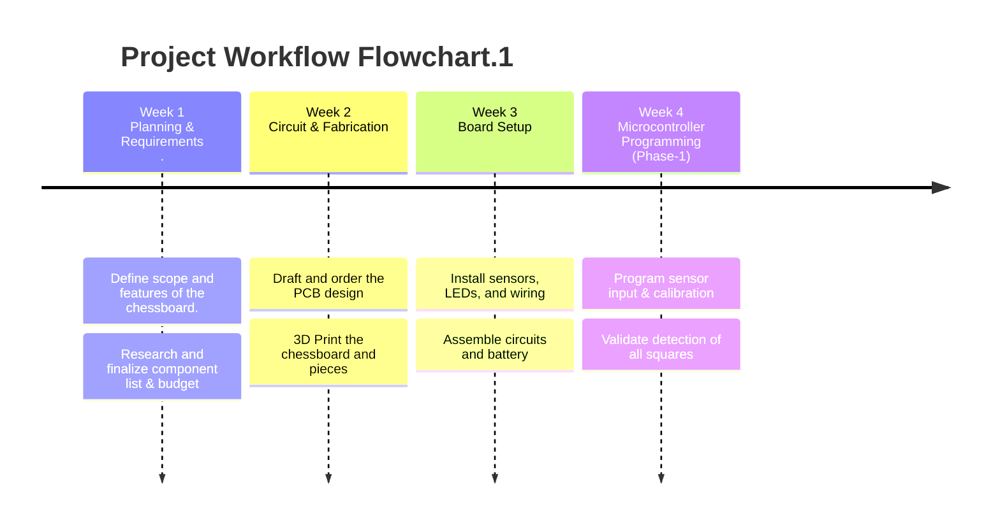
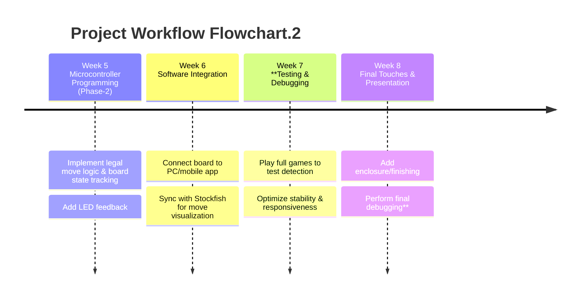

# 20251GTY54: Smart Chessboard-4

**An MEP1001 project manufactured by** 

**Professor - Sunil Jha**

**TA - Devesh, Priyansh**

**Group - 29**

**Team -** 

**Priyanshu Raj (Group Leader)**

**Raghav Agarwal**

**Aadit Prakash Bhagade**

**Patil Kshitij Nikesh**

**Anuroop Dixit**

**2025MT11771**

**2025MT11351**

**2025CS11115**

**2025CS51201**

**2025MT11348**

---

# Navigation

---

# Market Research

## ChessNut Move

](move_new.webp)

Source - [ChessNutech.com](https://www.chessnutech.com/)

This board specializes in self-moving pieces. The pieces have little wheels attached at the bottom, which can be used to travel to any square on the board, even controlling the other pieces if necessary to move out of the way. It is also integrated with websites like [chess.com](http://chess.com/) and [lichess.org](http://lichess.org/) and can be used to play games and puzzles alike.

### Product Specifications: -

- Size: 63.2 cm x 52 cm x 2.2 cm
- Piece material: wood or plastic
- Features:
    - Automatic chess piece movement
    - Full piece recognition
    - Video integration
- Price: 53,000 INR

## GoChess

](image.png)

Source - [GoChess](https://particula-tech.com/pages/gochess)

A board focused on movement, recognition and suggestion, GoChess uses an enhanced motion technology to provide a comfortable user experience. It also displays the possible moves for a player once a piece is picked up. It is a one-of-a-kind product, that can be utilised in both online and in-player modes.

### Product Specification: -

- Board Size: 48 cm × 48 cm × 3.5 cm (standard) / 48 cm × 48 cm × 0.9 cm (slim model)
- Square Size: 4.8 cm × 4.8 cm
- Piece Material: Wooden and Plastic (Classic and Modern styles)
- Board Material: High quality plastic
- Sensors: Magnetic/Hall effect sensors to detect piece placement
- Connectivity: Bluetooth (BLE)
- Battery: Rechargeable (user serviceable) battery
- Charging Port: USB-C
- App Compatibility: iOS, Android, Web
- Price: 50,000 INR

### Features: -

- Self-moving pieces
- Intelligent Coaching lights
- App integration

## ChessUp

](image%201.png)

Source - [PlayChessUp](https://playchessup.com/)

The ChessUp board, affiliated with [chess.com](http://chess.com/) itself, is a new and innovative way to play chess. It excels at suggesting and recognizing moves. It can be connected with the [chess.com](http://chess.com/) server and can be used to play live games, over-the board, puzzles and bots. It provides the facility of adhering to all fair-play regulations according to its parent-company’s policy.

### Product Specification: -

- Weight: 1.13 kg
- Playable Area: 30.5cm × 30.5cm
- Square Size: 38.1 mm
- Battery Lifetime: 6 hours (USB‑C rechargeable)
- Connectivity: Wi‑Fi + Bluetooth
- Included Pieces: 34 with recognition chips
- Integration: Built-in Chess.com, some support for Lichess, no phone needed
- Price - Rs 35,125 INR

### Key Features: -

- Size: 39.6cm × 34.6cm × 1.8cm
- Touch sensing
- LED guidance
- AI training
- Touchscreen UI
- Stockfish integration

---

# Our Product - KarpaC

A smart-board which is light, seamlessly integrable with [chess.com](http://chess.com/) and [lichess](http://lichess.org/), connected to Stockfish, aesthetically pleasing and intelligent. It recognizes moves played and provides best-move suggestions by lighting up squares. It can be used for both over-the-board and online play. Its affordable nature sets it apart from its competitors.

## Product Specifications -

- Board Size: 36 cm * 40 cm * 5 cm
- Square Size: 4 * 4 cm
- Weight: Less than 2 kg
- Piece Material: 3D Printer Filament
- Board Material: Acrylic
- Sensors: Hall effect sensors to detect piece placement.
- Connectivity: Bluetooth (BLE) and Wi-Fi through ESP 32
- Battery: 4000mAh rechargeable battery (6+ hours of playtime)
- Charging Port: USB-C
- App Compatibility: iOS, Android, Web

## Key Features -

- LED move indicators
- Automatic Move Detection
- Inbuilt Chess Engine (Stockfish 15).
- Legal moves and best move suggestions.
- Buzzer sound on an illegal/invalid move.
- Integrated with chess.com and [lichess.org](http://lichess.org/) through Wi-Fi

## Initial Production Cost Estimate - 10,275 **INR**

| **Item** | **Function** | **Quantity** | Rate | Net Price |
| --- | --- | --- | --- | --- |
| LED ([WS2812B](https://evelta.com/ws2812b-v5-5v-0-24w-digital-rgb-led-4-pin-smd5050/)) | Light the squares of the board | 90 | 10 | 900 |
| Hall Sensors ([SL353LT](https://robu.in/product/honeywell-board-mount-hall-effect-sensor-sl353lt-micro-omni-dig-hall-eff-sens-ic-lwdcycle/)) | Detection of Pieces | 70 | 50 | 3500 |
| ESP 32 Board
[ESP32 - SquadPixel](https://www.amazon.in/SquadPixel-ESP-32-Bluetooth-Development-Board/dp/B071XP56LM/ref=sr_1_3?crid=2YMWPATRHVFQV&dib=eyJ2IjoiMSJ9.T_X5Nbn2mH9dvueGcGZsRsyXe9ijsbVsgTo4euSrWE1NWVli055yK_Z8W16sZFmd6oTtwCcCtZl7Jb8z9Luz76Dt42K1rhuHEV5q37fvX7Kmb2I9uvYu-T7ftMTEXzi_WnqIRWw9zplGaiprD_tVNABvOrGJhj0FNsCALqphfu1L9Xnj8BaysoQn-J2tyS1p3kweTyamfB8eBGK2W4TDwKV7-1-qyiZJbA-8IVuW7bo.fPDoiJMa8vISuywgFenbK5NNL0ogECH4e1BvQ2w_RcU&dib_tag=se&keywords=esp32&qid=1757569554&sprefix=esp32%2Caps%2C315&sr=8-3) | GPIO Control and Wifi Connectivity | 1 | 527 | 527 |
| Raspberry Pi 4 Model B with 2 GB RAM ([Raspberry Pi 4](https://robu.in/product/raspberry-pi-4-model-b-with-2-gb-ram/)) | Move Processing and running ChessEngine | 1 | 4714 | 4714 |
| SNOOGG Neodymium Round Magnet 10x1.5 mm ([Neodymium Magnet](https://www.amazon.in/SNOOGG-Neodymium-Magnet-N35-20/dp/B0DMS7YBXF/)) | Installed below each piece to make them detectable by the hall effect sensors. | 80 | 622.4 | 622.4 |
| 5V Active Electromagnetic Buzzer ([5v Buzzer](https://robu.in/product/5v-active-electromagnetic-buzzer-pack-of-5/)) | Played on invalid moves | 1 | 11 | 11 |
| **Items Already Available**  | **in LAB :-** |  |  |  |
| PCB Board | Connect the circuits | - | - | - |
| Acrylic Sheet | Base for Chessboard | - | - |  - |
| 3D Printer Filament Black  | Chess Pieces | - | - | - |
| 3D Printer Filament White | Chess Pieces  | - | - | - |
|  Capacitors:
    ◦ 4 × 47–100 µF ceramic 1206
    ◦ 4 × 330 Ω resistor
    ◦ 1 × 470–1000 µF | Circuit Safety and smoother switching of LEDs | - | - | - |

## BOM

[BoM_MEP1001.xlsx](BoM_MEP1001.xlsx)

## Target Price - 24,998 INR

---

# Project WorkFlow Flowchart

---

# Conceptual Product Design

## CAD Design

Fusion 360

[Chess Board.f3d](Chess_Board.f3d)

## PCB Design

1. Schematic
    
    
    
    [EasyEDA](SCH_Schematic1_2025-09-11.pdf)
    
    EasyEDA
    
2. Wiring Layout
ESP32 (SDA) ---- SDA bus ---- MCP23017 (SDA pins, all 4 chips)
ESP32 (SCL) ---- SCL bus ---- MCP23017 (SCL pins, all 4 chips)
3.3V ---------- VCC (all sensors + MCP23017s)
GND ----------- GND (all sensors + MCP23017s)
Each Hall OUT → MCP23017 input pin
3. Board Design
    
    
    

We have 4 similar PCB’s with the minor difference of address configuration of MCP23017 (IO Expander).

## Electrical Design

From Each PCB, the following pads are present: -

| **5V** | Powers LEDs, Hall Sensors and MCP23017 (IO Expander) |
| --- | --- |
| **GND** | GND |
| **SDA** | SDA Line from MCP to ESP32 for hall input |
| **SCL** | SCL Line from MCP to ESP32 for data sync |
| **DIN** | Output line from ESP for controlling serial LEDs |

Controller Boards:- 

| ESP32 | Raspberry PI 4 (2GB) |
| --- | --- |
| Very fast for real time GPIO handling with very low latency.  | Multiple GPIO handling may lag. |
| Has wifi | Has wifi, but better range |
| Has lower memory (~526KB) | Has higher memory (2GB will be used)
Better for loading chess engine |
| Lower Processing Speed | Higher Processing Speed |
- A hybrid approach is the best here, where esp32 handles the gpio handling, and Raspberry Pi 4 handles the move processing and wifi output.

## On Paper Designs

Dimensions

Wiring Design