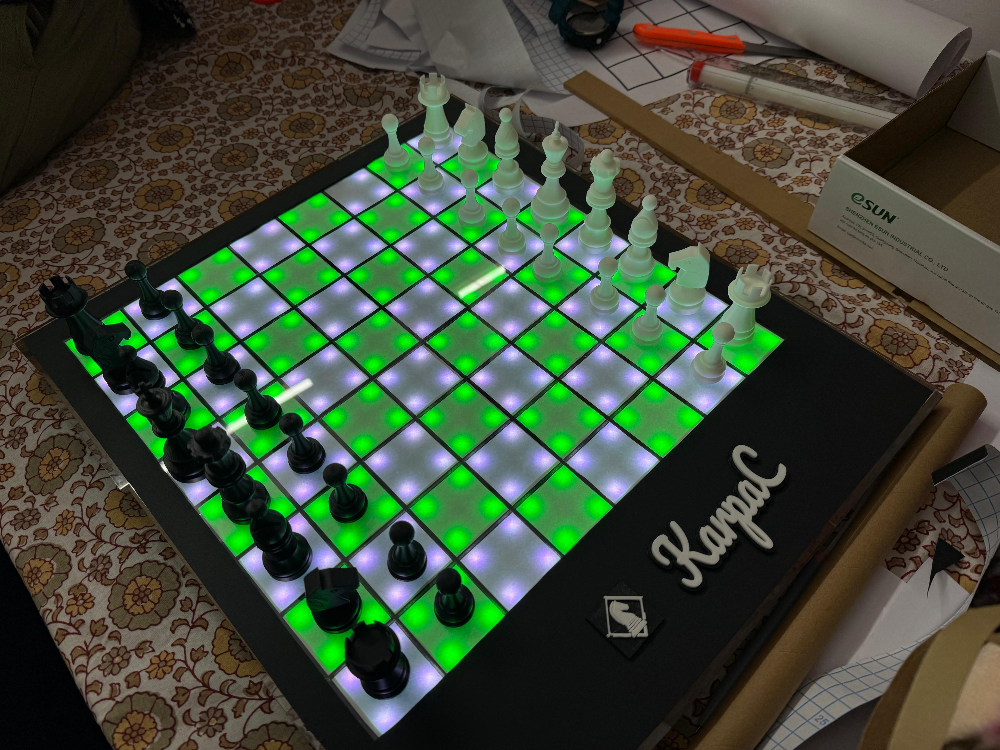
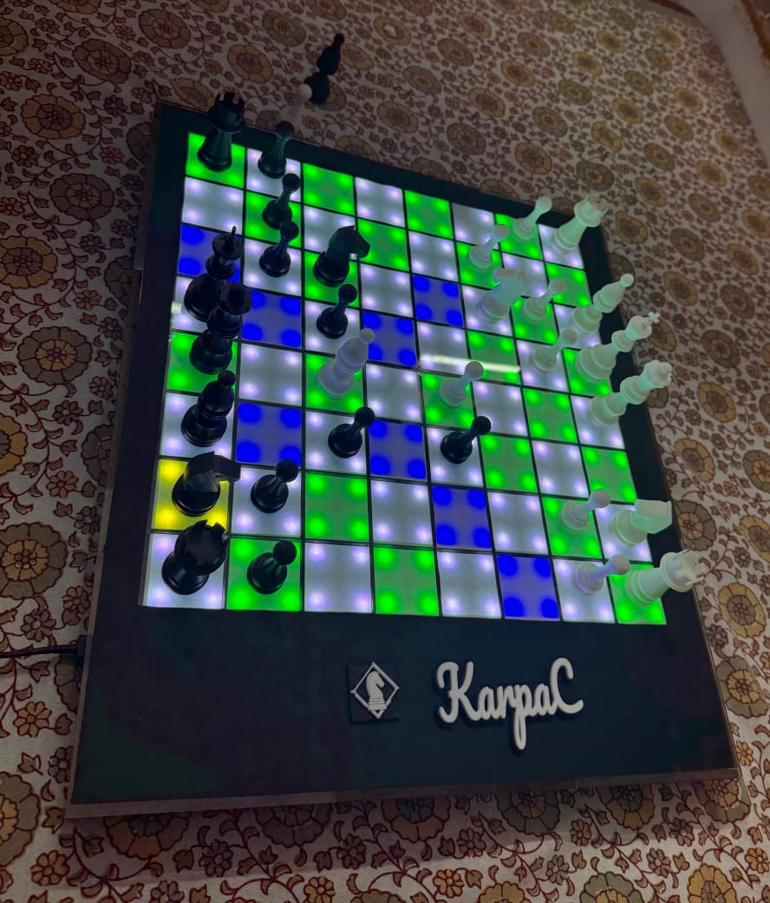

# KarpaC - Prototype1
This is a smart chessboard project that takes chess to the next level by integrating a physical board with a digital interface. 

  

## Features
- **Real-time Game Tracking**: Automatically detects and records moves made on the physical board.
- **Digital Interface**: Provides a user-friendly interface to view and analyze games.
- **Move Validation**: Ensures that all moves made are legal according to chess rules.
- **Against Computer**: Play against a computer opponent with adjustable difficulty levels.
- **Game Analysis[TODO]**: Offers insights and suggestions based on the game state.
- **Multiplayer Support[TODO]**: Allows multiple players to join and play together online.

## Implementation
### Hardware
1. **Hall Effect Sensors**: Used to detect the position of chess pieces on the board.
2. **Ws2812B LEDs**: RGB LEDs for visual feedback and effects.
3. **Raspberry Pi 4b**: Acts as the main controller for processing inputs and managing the game state.
4. **Chess Pieces**: 3d printed pieces with embedded neodymium magnets for reliable detection.
5. **Chessboard**: A simple but elegant design with acrylic surfaces.
6. **Power Supply**: A 5V 3A power supply to power the Raspberry Pi and LEDs.

### Software
1. **Python**: Main programming language for the project.
   - `RPi.GPIO`, `chess`, `neopixel`
2. **Flask**: Web framework for creating the digital interface.
3. **Stockfish**: Chess engine for game analysis and computer opponent.

### Logic
1. **Current State**: Used boundary condition + pick/place data to determine the current state of the board.
2. **Move Detection**: Compares the previous and current state to detect moves.
3. **Move Validation**: Uses the `chess` library to validate moves.

## Issues and Fixes
- **Hall Sensor** - H[1][5] was not working in the pcb, and since no spare were available, it is set to always on in the code.
- **Temperature** - The board tends to heat up after prolonged use(40-50 mins). Since no ventilation was designed on the prototype.
